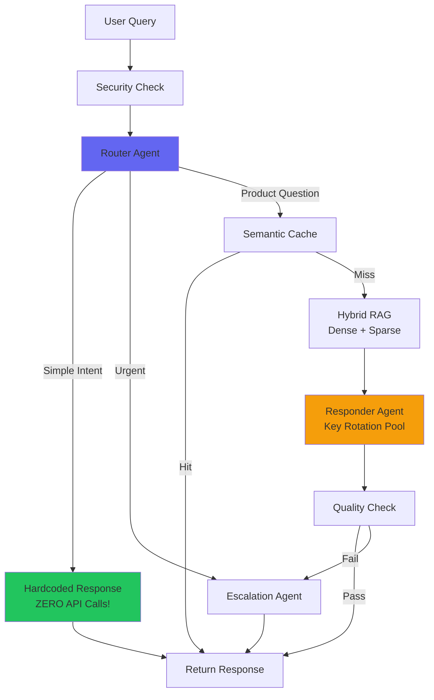

# AI Support Agent

Enterprise-grade AI-powered customer support agent with RAG (Retrieval-Augmented Generation), semantic caching, and multi-agent orchestration using LangGraph.

## 🚀 Key Features

- **Zero-LLM Simple Queries**: Greetings, farewells, and casual conversation are handled instantly without any API calls
- **Smart Intent Classification**: Pattern-based detection for 100+ simple phrases (greetings, appreciation, small talk, etc.)
- **API Key Rotation**: 4-key pool with automatic failover for quota resilience
- **Hybrid RAG Pipeline**: Combines dense (FAISS) and sparse (BM25) retrieval
- **Professional Flask UI**: Beautiful dark/light theme with glassmorphism design
- **Multi-Agent Orchestration**: LangGraph-based workflow with specialized agents

## Architecture



## Quick Start

### Prerequisites
- Python 3.11+
- Google AI API Keys (at least 1, recommended 4 for quota resilience)

### Installation

```bash
# Clone the repository
git clone https://github.com/moniem2020/ai-support-agent.git
cd ai-support-agent

# Install dependencies
pip install -r requirements.txt

# Set up environment variables
cp .env.example .env
# Edit .env with your API keys
```

### Environment Variables

```env
GOOGLE_API_KEY=your_main_api_key
GOOGLE_API_KEY_FAST=your_fast_tier_key
GOOGLE_API_KEYS_POOL=key1,key2,key3,key4
```

### Build Knowledge Base

```bash
python scripts/index_knowledge_base.py
```

### Run the Application

**Terminal 1: API Server**
```bash
uvicorn src.api.main:app --reload
```

**Terminal 2: Flask UI**
```bash
python src/web/app.py
```

Access the application:
- **Flask UI**: http://localhost:5000
- **API Docs**: http://localhost:8000/docs
- **API Health**: http://localhost:8000/api/v1/health

## Query Processing Flow

| Query Type | Example | LLM Called? | API Calls |
|------------|---------|-------------|-----------|
| Greeting | "hi", "hello", "hey" | ❌ NO | 0 |
| Farewell | "bye", "thanks bye" | ❌ NO | 0 |
| Appreciation | "thanks", "thank you" | ❌ NO | 0 |
| Small Talk | "how are you" | ❌ NO | 0 |
| Chitchat | "ok", "cool", "lol" | ❌ NO | 0 |
| Product Question | "how do I setup?" | ✅ YES | 1-2 |

## Key Components

### 🧠 Router Agent (`src/agents/router.py`)
- **Hybrid Classification**: Pattern-based for 140+ simple phrases, LLM for complex queries
- **Intent Categories**: greeting, farewell, appreciation, small_talk, chitchat, question, complaint
- **Product Keywords**: Detects billing, account, features, etc. for proper routing

### 🔄 API Key Rotation (`src/agents/responder.py`)
- **4-Key Pool**: Rotates through API keys on quota errors
- **Automatic Failover**: Catches 429 errors and switches keys
- **Tier-Based Routing**: All tiers can use the key pool

### 🎨 Flask UI (`src/web/`)
- **Dark/Light Themes**: Toggle with sun/moon button
- **Modern Design**: Glassmorphism, Inter font, smooth animations
- **Responsive**: Works on mobile and desktop

### 📚 RAG Pipeline (`src/rag/`)
- **Dense Retrieval**: FAISS + Google text-embedding-004
- **Sparse Retrieval**: BM25 keyword matching
- **Reranking**: Combines and reranks for relevance

## Configuration

Key settings in `src/config.py`:

```python
# Model Routing - ALL use gemini-2.5-flash for quota resilience
LLM_TIER_FAST = "gemini-2.5-flash"
LLM_TIER_1 = "gemini-2.5-flash"
LLM_TIER_2 = "gemini-2.5-flash"

# All tiers use key rotation pool
API_KEY_ROUTING = {
    "simple": "pool",
    "moderate": "pool",
    "complex": "pool",
}

# RAG Settings
CHUNK_SIZE = 512
DENSE_TOP_K = 10
SPARSE_TOP_K = 10
RERANK_TOP_K = 5

# Quality Thresholds
CONFIDENCE_THRESHOLD = 0.7
ESCALATION_THRESHOLD = 0.5
```

## Project Structure

```
ai-support-agent/
├── src/
│   ├── agents/           # Multi-agent orchestration
│   │   ├── graph.py      # LangGraph workflow (routes simple queries directly)
│   │   ├── router.py     # Intent classification (pattern + LLM hybrid)
│   │   ├── responder.py  # Response generation (key rotation + hardcoded)
│   │   └── escalation.py # Human handoff
│   ├── api/              # FastAPI backend
│   ├── cache/            # Semantic caching
│   ├── rag/              # RAG pipeline (dense + sparse)
│   ├── security/         # PII detection, injection defense
│   ├── web/              # Flask UI
│   │   ├── app.py        # Flask application
│   │   ├── templates/    # HTML templates
│   │   └── static/       # CSS/JS (dark/light themes)
│   └── ui/               # Streamlit UI (legacy)
├── data/
│   ├── knowledge_base/   # Markdown knowledge base
│   └── indexes/          # FAISS and BM25 indexes
└── scripts/
    ├── index_knowledge_base.py
    ├── test_quota.py     # Test API key quota
    └── list_models.py    # List available models
```

## API Endpoints

### Chat
```bash
POST /api/v1/chat
{
  "message": "How do I get started?",
  "user_id": "user123",
  "ticket_id": "optional"
}
```

### Health Check
```bash
GET /api/v1/health
```

### Metrics
```bash
GET /api/v1/metrics
```

## Quota Management Tips

1. **Use Multiple API Keys**: Add 4 keys to `GOOGLE_API_KEYS_POOL` for automatic rotation
2. **Simple Queries Are Free**: Greetings/farewells use zero API calls
3. **Monitor Key Usage**: Check logs for `[KEY ROTATION]` messages
4. **Consider Paid Tier**: Free tier has 20 requests/day per model limit

## Development

### Adding Knowledge Base Content
1. Add markdown files to `data/knowledge_base/`
2. Rebuild indexes: `python scripts/index_knowledge_base.py`
3. Restart the API server

### Testing API Keys
```bash
python scripts/test_quota.py
```

## Contributing

Contributions are very welcome! 🎉

1. Fork the repository
2. Create a feature branch (`git checkout -b feature/amazing-feature`)
3. Commit your changes (`git commit -m 'Add amazing feature'`)
4. Push to the branch (`git push origin feature/amazing-feature`)
5. Open a Pull Request

## License

MIT License

## Built With

- [LangGraph](https://github.com/langchain-ai/langgraph) - Multi-agent orchestration
- [LangChain](https://github.com/langchain-ai/langchain) - RAG framework
- [FastAPI](https://fastapi.tiangolo.com/) - API framework
- [Flask](https://flask.palletsprojects.com/) - Web UI framework
- [FAISS](https://github.com/facebookresearch/faiss) - Vector search
- [Google Gemini](https://ai.google.dev/) - LLM and embeddings

---

<p align="center">Made with ❤️ by MG</p>
