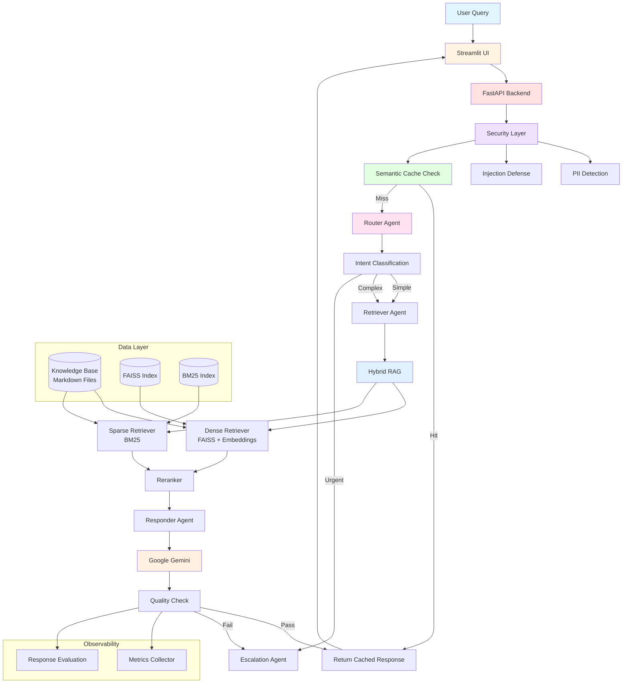

# AI Support Agent

Enterprise-grade AI-powered customer support agent with RAG (Retrieval-Augmented Generation), semantic caching, and multi-agent orchestration using LangGraph.

## Architecture



## Features

### Core Capabilities
- **Multi-Agent Orchestration**: LangGraph-based workflow with specialized agents
- **Hybrid RAG Pipeline**: Combines dense (FAISS) and sparse (BM25) retrieval
- **Semantic Caching**: Reduces latency and API costs for similar queries
- **Security-First**: PII detection/anonymization and prompt injection defense
- **Quality Assurance**: Automated response evaluation and escalation
- **Observability**: Comprehensive metrics and performance tracking

### Key Components

#### 🔐 Security Layer
- **PII Detection**: Automatically detects and anonymizes sensitive information
- **Injection Defense**: Protects against prompt injection attacks
- **Input Validation**: Sanitizes and validates all user inputs

#### 🧠 Multi-Agent System
- **Router Agent**: Classifies intent and determines routing strategy
- **Retriever Agent**: Performs adaptive hybrid retrieval
- **Responder Agent**: Generates contextual, grounded responses
- **Escalation Agent**: Handles complex cases requiring human intervention
- **Quality Agent**: Validates response quality and confidence

#### 📚 RAG Pipeline
- **Dense Retrieval**: Semantic search using FAISS + Google text-embedding-004
- **Sparse Retrieval**: Keyword matching using BM25
- **Reranking**: Combines and reranks results for optimal relevance
- **Adaptive Strategy**: Adjusts retrieval based on query complexity

#### ⚡ Performance Optimization
- **Semantic Cache**: In-memory cache with similarity search
- **Lazy Loading**: Deferred initialization to reduce startup time
- **Streaming Responses**: Real-time response generation
- **Model Routing**: Tier-based model selection (Gemini Flash/Pro)

## Quick Start

### Prerequisites
- Python 3.11+
- Google AI API Key

### Installation

1. **Clone the repository**
```bash
git clone https://github.com/moniem2020/ai-support-agent.git
cd ai-support-agent
```

2. **Install dependencies**
```bash
pip install -r requirements.txt
```

3. **Set up environment variables**
```bash
cp .env.example .env
# Edit .env and add your GOOGLE_API_KEY
```

4. **Build knowledge base indexes**
```bash
python scripts/index_knowledge_base.py
```

### Running the Application

**Option 1: Start services separately**
```bash
# Terminal 1: Start API server
uvicorn src.api.main:app --reload

# Terminal 2: Start Streamlit UI
streamlit run src/ui/app.py
```

**Option 2: Use the combined runner (recommended)**
```bash
python run_all.py
```

The application will be available at:
- **Streamlit UI**: http://localhost:8501
- **API Docs**: http://localhost:8000/docs
- **API Health**: http://localhost:8000/api/v1/health

## Project Structure

```
ai-support-agent/
├── src/
│   ├── agents/          # Multi-agent orchestration
│   │   ├── graph.py     # LangGraph workflow
│   │   ├── router.py    # Intent classification
│   │   ├── retriever.py # Adaptive retrieval
│   │   ├── responder.py # Response generation
│   │   └── escalation.py # Human handoff
│   ├── api/             # FastAPI backend
│   │   ├── main.py      # API entry point
│   │   └── routes.py    # API endpoints
│   ├── cache/           # Semantic caching
│   ├── rag/             # RAG pipeline
│   │   ├── chunker.py   # Document chunking
│   │   ├── dense_retriever.py   # FAISS retrieval
│   │   ├── sparse_retriever.py  # BM25 retrieval
│   │   ├── reranker.py  # Result reranking
│   │   └── embeddings.py # Embedding service
│   ├── security/        # Security modules
│   │   ├── pii_detector.py      # PII detection
│   │   └── injection_defense.py # Injection prevention
│   ├── observability/   # Metrics and evaluation
│   └── ui/              # Streamlit interface
├── data/
│   ├── knowledge_base/  # Markdown knowledge base
│   └── indexes/         # FAISS and BM25 indexes
├── scripts/
│   └── index_knowledge_base.py  # Index builder
└── requirements.txt
```

## Configuration

Key configuration parameters in `src/config.py`:

```python
# RAG Settings
CHUNK_SIZE = 800           # Characters per chunk
CHUNK_OVERLAP = 200        # Overlap between chunks
DENSE_TOP_K = 10          # Dense retrieval results
SPARSE_TOP_K = 10         # Sparse retrieval results
RERANK_TOP_K = 5          # Final results after reranking

# Quality Thresholds
CONFIDENCE_THRESHOLD = 0.7    # Minimum confidence
ESCALATION_THRESHOLD = 0.5    # Escalate below this

# Model Selection
EMBEDDING_MODEL = "models/text-embedding-004"
LLM_TIER_1 = "gemini-1.5-flash-002"  # Fast queries
LLM_TIER_2 = "gemini-1.5-pro-002"    # Complex queries
```

## API Endpoints

### Health Check
```bash
GET /api/v1/health
```

### Query Processing
```bash
POST /api/v1/query
{
  "query": "How do I reset my password?",
  "user_id": "user123",
  "ticket_id": "ticket456"
}
```

### Metrics
```bash
GET /api/v1/metrics
```

## Development

### Adding Knowledge Base Content

1. Add markdown files to `data/knowledge_base/`
2. Rebuild indexes: `python scripts/index_knowledge_base.py`
3. Restart the application

### Running Tests
```bash
pytest tests/
```

### Code Quality
```bash
# Format code
black src/

# Lint
flake8 src/

# Type checking
mypy src/
```

## Monitoring & Observability

The system tracks:
- **Response Quality**: Confidence scores, groundedness
- **Performance**: Latency, cache hit rate, model usage
- **Security**: PII detection rate, injection attempts
- **User Behavior**: Intent distribution, escalation rate

Access metrics at `/api/v1/metrics` or view in the UI sidebar.

## Deployment

### Production Considerations

1. **Security**
   - Set proper CORS origins in `src/api/main.py`
   - Use environment variables for secrets
   - Enable HTTPS/TLS

2. **Performance**
   - Use Redis for distributed caching
   - Deploy with Gunicorn/Uvicorn workers
   - Consider GPU for embeddings at scale

3. **Monitoring**
   - Integrate with Prometheus/Grafana
   - Set up error tracking (Sentry)
   - Enable structured logging

### Docker Deployment
```bash
# Build image
docker build -t ai-support-agent .

# Run container
docker run -p 8000:8000 -p 8501:8501 \
  -e GOOGLE_API_KEY=your_key \
  ai-support-agent
```

## Contributing

1. Fork the repository
2. Create a feature branch
3. Make your changes
4. Write/update tests
5. Submit a pull request

## License

MIT License - see LICENSE file for details

## Acknowledgments

Built with:
- [LangGraph](https://github.com/langchain-ai/langgraph) - Multi-agent orchestration
- [LangChain](https://github.com/langchain-ai/langchain) - RAG framework
- [FastAPI](https://fastapi.tiangolo.com/) - API framework
- [Streamlit](https://streamlit.io/) - UI framework
- [FAISS](https://github.com/facebookresearch/faiss) - Vector search
- [Google Gemini](https://ai.google.dev/) - LLM and embeddings
