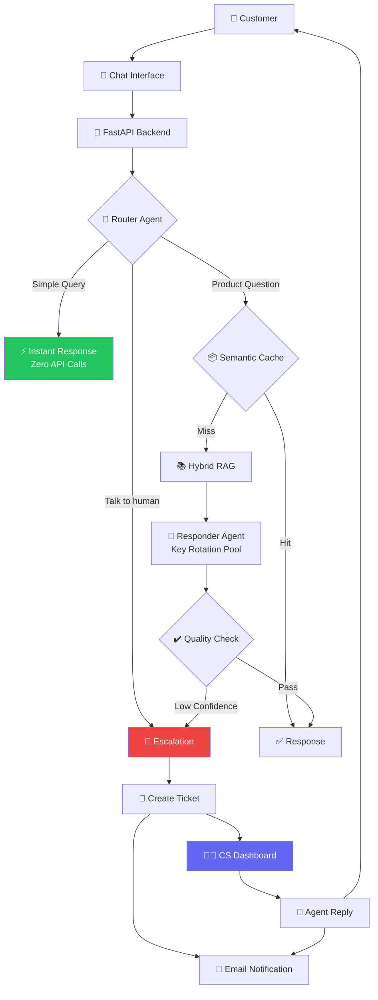

<div align="center">

# 🤖 AI Support Agent

[](https://python.org)
[](https://fastapi.tiangolo.com)
[](LICENSE)
[](CONTRIBUTING.md)

**Enterprise-grade AI-powered customer support system with RAG, real-time agent chat, and intelligent escalation.**

[Features](#-features) • [Quick Start](#-quick-start) • [Architecture](#-architecture) • [Documentation](#-documentation) • [Contributing](#-contributing)

</div>

---

## ✨ Features

### 🎯 Core Capabilities

| Feature | Description |
|---------|-------------|
| **🤖 AI-Powered Responses** | Uses Google Gemini with RAG for context-aware answers |
| **💬 Real-Time Agent Chat** | Two-way communication between CS agents and customers |
| **📧 Email Notifications** | Automatic emails when agents reply or ticket status changes |
| **🚨 Smart Escalation** | Auto-escalates when AI confidence is low or user requests human help |
| **⚡ Zero-LLM Greetings** | Instant responses for greetings, farewells, and small talk (0 API calls) |
| **🔄 API Key Rotation** | Automatic failover across 4+ API keys for quota resilience |

### 🛠️ For Support Agents

| Feature | Description |
|---------|-------------|
| **📊 CS Dashboard** | Protected admin panel at `/cs` for ticket management |
| **💬 Live Chat Interface** | Jump into any conversation with full history |
| **📝 Internal Notes** | Private notes visible only to agents |
| **🔔 Escalation Alerts** | Instant visibility into tickets needing human attention |

### 🔒 Enterprise-Ready

- **Semantic Caching** - Reduces API costs by caching similar queries
- **PII Detection** - Automatic detection and protection of sensitive data
- **Hybrid RAG** - Combines dense (FAISS) and sparse (BM25) retrieval
- **Session Management** - 24-hour auto-expiry with manual "New Chat" option

---

## 🚀 Quick Start

### Prerequisites

- Python 3.11+
- Google AI API Key ([Get one free](https://aistudio.google.com/app/apikey))

### Installation

```bash
# Clone the repository
git clone https://github.com/moniem2020/AI-Support-Agent-for-Saas.git
cd AI-Support-Agent-for-Saas

# Create virtual environment
python -m venv venv
source venv/bin/activate  # On Windows: venv\Scripts\activate

# Install dependencies
pip install -r requirements.txt

# Set up environment variables
cp .env.example .env
# Edit .env with your API keys (see Configuration below)
```

### Build Knowledge Base

```bash
python scripts/index_knowledge_base.py
```

### Run the Application

Open two terminals:

**Terminal 1: API Server**
```bash
uvicorn src.api.main:app --reload
```

**Terminal 2: Web UI**
```bash
python src/web/app.py
```

### Access Points

| URL | Description |
|-----|-------------|
| http://localhost:5001 | Customer Chat Interface |
| http://localhost:5001/cs | CS Agent Dashboard (login required) |
| http://localhost:8000/docs | API Documentation (Swagger) |
| http://localhost:8000/api/v1/health | Health Check Endpoint |

---

## 🏗️ Architecture


```mermaid
graph TB
    User[👤 Customer] --> Chat[💬 Chat Interface]
    Chat --> API[🔌 FastAPI Backend]
    
    API --> Router{🧠 Router Agent}
    
    Router -->|Simple Query| Direct[⚡ Instant Response<br/>Zero API Calls]
    Router -->|"Talk to human"| Escalate[🚨 Escalation]
    Router -->|Product Question| Cache{📦 Semantic Cache}
    
    Cache -->|Hit| Response[✅ Response]
    Cache -->|Miss| RAG[📚 Hybrid RAG]
    
    RAG --> Responder[🤖 Responder Agent<br/>Key Rotation Pool]
    Responder --> Quality{✔️ Quality Check}
    
    Quality -->|Pass| Response
    Quality -->|Low Confidence| Escalate
    
    Escalate --> Ticket[🎫 Create Ticket]
    Ticket --> Email[📧 Email Notification]
    Ticket --> Dashboard[👨‍💼 CS Dashboard]
    
    Dashboard --> Agent[💬 Agent Reply]
    Agent --> Email
    Agent --> User
    
    style Direct fill:#22c55e,color:#fff
    style Escalate fill:#ef4444,color:#fff
    style Dashboard fill:#6366f1,color:#fff
```

---

## ⚙️ Configuration

Create a `.env` file in the project root:

```env
# ===================
# Google AI API Keys
# ===================
GOOGLE_API_KEY=your_main_api_key
GOOGLE_API_KEYS_POOL=key1,key2,key3,key4  # For rotation

# ===================
# CS Dashboard Auth
# ===================
CS_USERNAME=admin
CS_PASSWORD=your_secure_password
FLASK_SECRET_KEY=your-random-secret-key

# ===================
# Email Notifications (Optional)
# ===================
SMTP_HOST=smtp.gmail.com
SMTP_PORT=587
SMTP_USER=your-email@gmail.com
SMTP_PASSWORD=your-gmail-app-password
EMAIL_FROM_NAME=AI Support Agent
EMAIL_ENABLED=true
```

> **📧 Gmail App Password**: For Gmail, use an [App Password](https://myaccount.google.com/apppasswords) instead of your regular password.

---

## 📖 Documentation

### Query Processing

| Query Type | Example | LLM Called? | Response Time |
|------------|---------|-------------|---------------|
| Greeting | "hi", "hello" | ❌ No | <10ms |
| Farewell | "bye", "thanks" | ❌ No | <10ms |
| Small Talk | "how are you" | ❌ No | <10ms |
| Product Question | "how do I setup?" | ✅ Yes | 1-3s |
| Escalation Request | "talk to human" | ❌ No | <100ms |

### Key Components

| Component | Location | Purpose |
|-----------|----------|---------|
| Router Agent | `src/agents/router.py` | Intent classification (140+ patterns) |
| Responder Agent | `src/agents/responder.py` | Response generation with key rotation |
| RAG Pipeline | `src/rag/` | Dense + Sparse retrieval |
| Ticket Store | `src/tickets/ticket_store.py` | Ticket persistence |
| Email Service | `src/notifications/email_service.py` | SMTP notifications |

### API Endpoints

```bash
# Chat
POST /api/v1/chat
{
  "message": "How do I get started?",
  "user_id": "user123",
  "session_id": "optional_session_id",
  "user_email": "user@example.com"
}

# Tickets
GET  /api/v1/tickets              # List all tickets
GET  /api/v1/tickets/{id}         # Get ticket details
POST /api/v1/tickets/{id}/reply   # Agent reply
PUT  /api/v1/tickets/{id}/status  # Update status

# Health
GET /api/v1/health
```

---

## 📁 Project Structure

```
ai-support-agent/
├── src/
│   ├── agents/           # Multi-agent orchestration
│   │   ├── graph.py      # LangGraph workflow
│   │   ├── router.py     # Intent classification
│   │   └── responder.py  # Response generation
│   ├── api/              # FastAPI backend
│   │   ├── routes.py     # Chat endpoints
│   │   └── ticket_routes.py  # Ticket endpoints
│   ├── notifications/    # Email service
│   ├── rag/              # RAG pipeline
│   ├── tickets/          # Ticket management
│   └── web/              # Flask UI
│       ├── templates/    # HTML templates
│       └── static/       # CSS/JS assets
├── data/
│   ├── knowledge_base/   # Markdown docs
│   └── indexes/          # FAISS/BM25 indexes
└── scripts/              # Utility scripts
```

---

## 🗺️ Roadmap

- [x] AI-powered chat with RAG
- [x] CS Agent Dashboard
- [x] Two-way real-time chat
- [x] Email notifications
- [ ] Priority levels & SLA tracking
- [ ] Analytics dashboard with charts
- [ ] Canned responses for agents
- [ ] Multi-language support

---

## 🤝 Contributing

We love contributions! Here's how you can help:

1. **Fork** the repository
2. **Create** a feature branch (`git checkout -b feature/amazing-feature`)
3. **Commit** your changes (`git commit -m 'Add amazing feature'`)
4. **Push** to the branch (`git push origin feature/amazing-feature`)
5. **Open** a Pull Request

### Development Setup

```bash
# Install dev dependencies
pip install -r requirements-dev.txt

# Run tests
pytest

# Format code
black src/
```

---

## 📜 License

This project is licensed under the MIT License - see the [LICENSE](LICENSE) file for details.

---

## 🙏 Acknowledgments

Built with these amazing tools:

- [LangGraph](https://github.com/langchain-ai/langgraph) - Multi-agent orchestration
- [LangChain](https://github.com/langchain-ai/langchain) - RAG framework
- [FastAPI](https://fastapi.tiangolo.com/) - Modern API framework
- [Flask](https://flask.palletsprojects.com/) - Web UI framework
- [FAISS](https://github.com/facebookresearch/faiss) - Vector search
- [Google Gemini](https://ai.google.dev/) - LLM and embeddings

---

<div align="center">

**⭐ Star this repo if you find it helpful!**

Made with ❤️ by [MG](https://github.com/moniem2020)

</div>
